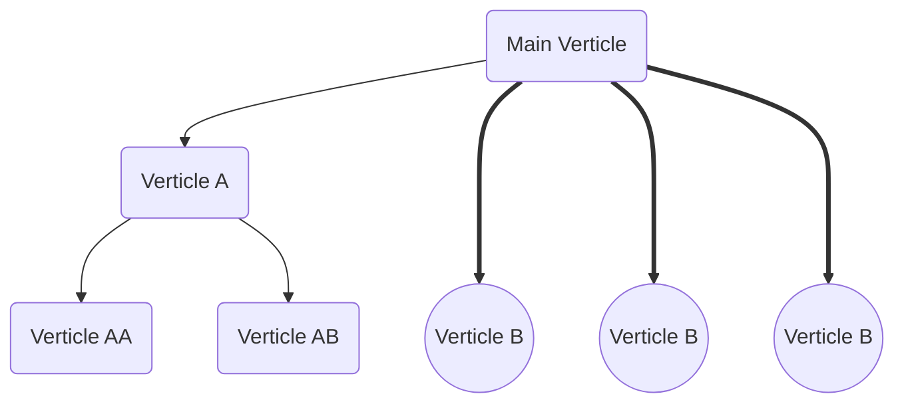
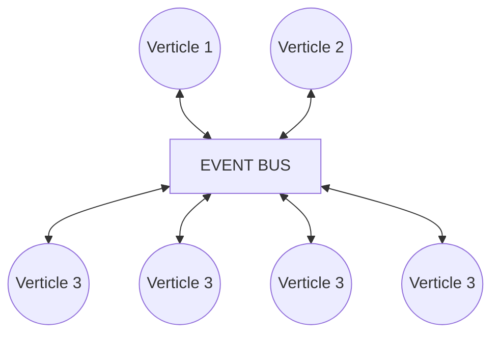

# Vert.x

Framework for building reactive apps.

## Reactive system

- **Elastic:** Scale threads to handle more load (React to load)
- **Resillent:** Recover from failure without crash (React to failure)
- **Message Driven:**
  - Event Loops
  - Verticles (Actor like deployment model)
  - Vert.x Event Bus (For communication)
  - Async Programming (Promise/Future)
- **Responsive:** Quick and Scale

---

## Vertx object

Vertx is the main object.

```java
class VerticleExample {
  public static void main(String[] args) {
    var vertx = Vertx.vertx();
    vertx.deployVerticle(new MainVerticle());
  }
}
```

Only 1 `Vertx` object needed for application

---

## Verticle

Actor like deployment and concurrency model.
Verticles are deployed as tree with parent-child relationships.

### Deploying multiple verticles



Multiple verticles can be deployed by vertx instance.
Here `Main Verticle` Has deployed 1 instance of `Verticle A`
(which itself has deployed 2 verticles `Verticle AA` and
`Vertilce AB` as its children) and 3 instances of `Verticle B`
(each running on different threads).

Verticle code is executed in non-blocking fashion.

The event loop thread guarantees thread safety for verticles.
Put only non-blocking code in the event loop.

Verticles communicate via the event bus.

Typically all verticles use the same `Vertx` instance.

For creating verticles custom Verticles need to extend from `AbstractVerticle`.

```java
public class VerticleExample extends AbstractVerticle {
  //...
}
```

Whenever verticle is deployed, its `start` method is called which can be overridden.

```java
public class MainVerticle extends AbstarctVerticle {
  public static void main(String[] args) {
    final Vertx vertx = Vertx.vertx();
    vertx.deployVerticle(new MainVerticle());
  }

  @Override
  public void start(final Promise<Void> startPromise) throws Exception {
    // Initialize
    startPromise.complete(); // Signals that intialization is complete
  }
}
```

The parents are deployed first in a *Breadth-First* manner.

Similar to `start` method, the `stop` method is called when
verticle is undeployed.

```java
public class MainVerticle extends AbstarctVerticle {
  public static void main(String[] args) {
    final Vertx vertx = Vertx.vertx();
    vertx.deployVerticle(new MainVerticle());
  }

  @Override
  public void stop(final Promise<Void> stopPromise) throws Exception {
    // ...
    stopPromise.complete();
  }
}
```

```java
public class MainVerticle extends AbstarctVerticle {
  public static void main(String[] args) {
    final Vertx vertx = Vertx.vertx();
    vertx.deployVerticle(new MainVerticle(), whenDeployed -> {
      // Executed when verticle is deployed
      vertx.undeploy(whenDeployed.result()); // Manually undeploying
      // whenDeployed.result() contains id of verticle
    });
  }
}
```

Multiple instances of verticle can be deployed as
`vertx.deployVerticle(ClassNameString, DeploymentOptions)`

```java
class MainVerticle extends AbstractVerticle {

  public static void main(String[] args) {
    final Vertx vertx = Vertx.vertx();
    vertx.deployeVerticle(
      MainVerticle.class.getName(),
      new DeploymentOptions().setInstances(4)
    );
  }
}
```

This method deployes each instance on different thread.
See [VerticleN.java](src/main/java/verticles/VerticleN.java).
**Don't** deploye **all** verticles with multiple instances.

### Verticle configuration

Deployment configs can be set using `DeploymentOptions()`.

```java
import java.util.UUID;

class MainVerticle extends AbstractVerticle {
  public static void main(String[] args) {
    final Vertx vertx = Vertx.vertx();
    vertx.deployVerticle(
      Verticle.class.getName(),
      new DeploymentOptions()
        .setInstances(4)
        .setConfig(
          new JsonObject()
            .put("id", UUID.randomUUID().toString())
            .put("name", Verticle.class.getSimpleName())
        )
    );
  }
}
```

**NOTE** Make sure `JsonObject` class is imported from `io.vertx.core.json`.

The config can be accessed inside as `config().toString()`

```java
class Verticle extends AbstractVerticle {
  // ...
  @Override
  public void start(Promise<Void> startPromise) throws Exception {
    System.out.println(config().toString()); // JSON String
  }
}
```

In the above example the value of `"id"` config variable will be same
in all instances so that a verticle can be deployed multiple times with
same configs.

## Logging

TODO
[log4j2.xml](src/main/resources/log4j2.xml)

## Event Loop

The Event Loop thread is never blocked since it has a built-in **block checker**.

It can be configured as

```java
import java.util.concurrent.TimeUnit;

class EventLoopExample extends AbstractVerticle {
  var vertx = Vertx.vertx(
    new VertxOptions()
      .setMaxEventLoopExecuteTime(500)
      .setMaxEventLoopExecuteTimeUnit(TimeUnit.MILLISECONDS)
      .setBlockedThreadCheckInterval(1)
      .setBlockedThreadCheckIntervalUnit(TimeUnit.SECONDS)
      .setEventLoopPoolSize(2) // Only 2 threads for event loop
  );
}
```

For full example refer [EventLoopExample.java](src/main/java/eventloops/EventLoopExample.java)

### Workers

Workers can be used to execute long-running blocking code.

Create worker thread with `setWorker(true)` in
`DeployemntOptions` then execute the worker thread with
`vertx.executeBlocking(handler)`

Example:

```java
class WorkerExample extends AbstarctVerticle {

  public static void main(String[] args) {
    var vertx = Vertx.vertx();
    vertx.deployVerticle(new WorkerExample());
  }

  @Override
  public void start(Promise<Void> startPromise) throws Exception {
    vertx.deployVerticle(
      new WorkerVerticle(),
      new DeploymentOptions()
        .setWorker(true)
        .setWorkerPoolSize(1)
        .setWorkerPoolName("New Worker")
    );
    startPromise.complete();
    vertx.executeBlocking(event -> {
      // Blocking code
    }, result -> { // Optional
      if (result.succeeded()) {
        // ...
      } else {
        // ...
      }
    });
  }
}
```

### Event Bus

The Event Bus can be seen as the nervous system of vert.x. It provides thread
safe, non-blocking communication. There is **only one** Event Bus instance per
Vertx instance.



The event bus supports three ways of messaging

- Publish/Subscribe messaging
- point to point messaging
- Request-Response messaging

The Event Bus can be accessed with `vertx.eventBus()`

#### Request-Response

Request can be sent as `vertx.eventBus().request(address,message,callback);`. `vertx`
is an instance of Vertx declared as `Vertx vertx = Vertx.vertx();`

|          |                                                                        |
|----------|------------------------------------------------------------------------|
|address   | unique string value (no defined schema from vert.x, can use any style) |
| message  | can be string, vertx objects or custom objects                         |
| callback | executed when response is received                                     |

```java
public class RequestVerticle extends AbstractVerticle {
  @Override
  public void start(Promise<Void> startPromise) throws Exception {
    startPromise.complete();
    vertx.eventBus().request("new.request.address", "New message", reply -> {
      if (reply.succeeded) {
        // reply.result().body() contains the result
      } else {
        // ...
      }
    });

    // message type can also be specified
    vertx.eventBus().<String>request("new.request.address", "New message", reply -> {
      // ...
    });
  }
}
```

Response received through `vertx.eventBus().consumer(address,callback)`.

|          |                                                 |
|----------|-------------------------------------------------|
| address  | unique string address (same as request address) |
| callback | function to act on message received             |

```java
public class ResponseVerticle extends AbstractVerticle {
  @Override
  public void start(Promise<Void> startPromise) throws Exception {
    startPromise.complete();
    vertx.eventBus().consumer("new.request.address", message -> {
      message.reply(/* RESPONSE */);
    });

    // message type can also be specified
    vertx.eventBus().<String>consumer("new.request.address", message -> {
      message.reply(/* RESPONSE */);
    });

    // Delivery options can also be defined as second parameter
    vertx.eventBus().<String>consumer("new.request.address", message -> {
      message.reply("response", new DeliveryOptions().setSendTimeout()); // Default 30 seconds
    });

  }
}
```

Refer [RequestResponseExample.java](src/main/java/eventbus/RequestResponseExample.java)

#### Point-to-Point

Verticles communicate with each other without any response.

The message is sent using `vertx.eventBus().send(address,message);`

```java
public class Sender extends AbstractVerticle {
  @Override
  public void start(Promise<Void> startPromise) throws Exception {
    startPromise.complete();
    vertx.eventBus().send("unique address", "New Message");
  }
}
```

Message is consumed same as request-response. However, no reply can be sent in this case.

```java
public class Receiver extends AbstractVerticle {
  @Override
  public void start(Promise<Void> startPromise) throws Exception {
    startPromise.complete();
    vertx.eventBus().<String>consumer("unique address", message -> {
      // message.body() contains message
    });
  }
}
```

Messages can be sent periodically using `vertx.setPeriodic(delay, callback);`.

```java
public class Sender extends AbstractVerticle {
  @Override
  public void start(Promise<Void> startPromise) throws Exception {
    startPromise.complete();
    vertx.setPeriodic(
      1000, // delay in milliseconds
      id -> { // id of timer
        vertx.eventBus().send("unique address", "New Message"); // sent periodically after 1 second
      });
  }
}
```

Refer [Point2Point.java](src/main/java/eventbus/Point2PointExample.java)

#### Publish/Subscribe

One verticle publishes a message which can be received by multiple subscribers at the same
time (like braodcats message).

Message can be published to all subscribers of an address by `vertx.eventBus().publish(address, message);`

```java
public class Publisher extends AbstarctVerticle {
  @Override
  public void start(Promise<Void> startPromise) throws Exception {
    vertx.eventBus() < String > publish("unique address", "some message");
  }
}
```

Message consumer is same as previous two.

```java
public class Subscriber extends AbstractVerticle {
  @Override
  public void start(Promise<Void> startPromise) throws Exception {
    vertx.eventBus().<String>consumer("unique address", message -> {
      // message.body()
    });
  }
}
```

Multiple instances of Subscriber class can be deployed as well as multiple
consumers can be used for subscribing to the publisher using the unique address.

```java
public class PubSubExample extends Abstractverticle {
  public static void main(String[] args) {
    var vertx = Vertx.vertx();
    // The classes must be public otherwise Vertx will not be able to instantiate
    vertx.deployVerticle(new Subscriber());
    vertx.deployVerticle(new Subscriber());
    vertx.deployVerticle(
      Subscriber.class.getName(),
      new DeploymentOptions().setInstances(2)
    );
    // Handler is called 4 times for each instance
  }
}
```

Refer [PubSubExample.java](src/main/java/eventbus/PubSubExample.java)

### JSON Object

Vertx has built in `JsonObject` and `JsonArray` class implementation in `io.vertx.core.json`.

When created using Vertx starter website ([start.vertx.io](https://start.vertx.io))
JUnit5 is already configured.

Properties can be added using `jsonObject.put()` method as key/value pair. The keys can be
string and values can be any object type.

`jsonObject.encode()` returns String representation of the JSON Object;

```java
import io.vertx.core.json;

public class JSONObjectExample {
  public static void main(String[] args) {
    JsonObject jsonObject = new JsonObject();

    jsonObject.put("key", value);
  }
}
```

The `JSONObject` constructor can take the encoded String as parameter. It can also take an
existing `Map<String, Object>` object.

```java
import io.vertx.core.json;

import java.util.HashMap;

public class JSONObjectExample {
  public static void main(String[] args) {
    JsonObject jsonObjectUsingString = new JsonObject("{\"id\": 1, \"name\": \"Alice\"}");

    Map<String, Object> newMap = new HashMap<>();
    map.put("id", 1);
    map.put("name", "Alice");

    JSONObject jsonObjectUsingMap = new JSONObject(newMap);
  }
}
```

Use `JSONArray.add()` method to add `JSONObject` to a `JSONArray` instance.

```java
import io.vertx.core.json;

public class JSONObjectExample {
  public static void main(String[] args) {
    final JsonArray jsonArray = new JsonArray();
    jsonArray
      .add(new JsonObject().put("id", 1))
      .add(new JsonObject().put("id", 2))
      .add(new JsonObject().put("id", 3))
      .add(new JsonObject().put("id", 4))
      .add("Random Value");
  }
}
```

The `JSONArray` object similar to JSON array, can take any
valid object (allows heterogeneous type). In the above example
`String` object is also added with instances of `JSONObject`.

The `JsonObject` can also be initialized from custom objects. The
object must have appropriate methods available (getters, setters and
default constructor).

```java
import io.vertx.core.json;

public class JSONObjectExample {
  public static void main(String[] args) {
    JsonObject jsonObject = JsonObject.mapFrom(object);
  }
}
```

Refer
[JSONObjectExample.java](src/test/java/com/example/starter/json/JSONObjectExample.java)
for complete test suite and [Person.java](src/test/java/com/example/starter/json/Person.java)
for custom object example.

#### Sending JsonObject through the event bus

Vertx is pre-configured to send and receive `JsonObject` through
the event bus. In the request use `vertx.eventBus().<JsonObject>request(...)`
and for the response use `vertx.eventBus().<JsonObject>response(...)`.

If using JsonArray (either in request or response) use `JsonArray`.

#### Sending custom objects through event bus

TODO

## Future and Promise

- Allow simple coordination of async tasks
- Provides with a functional programming approach to replace callbacks

### Promise

Used to write an eventual value which can be marked as completed/failed.

Lives in a small context (inside a function).

```java
class PromiseFutureExample {
  // ...
  public static void asyncTask() {
    final Promise<String> promise = Promise.promise();
    vertx.setTimer(500, id -> promise.comlete("Success"));
  }
}
```

### Future

used to read value from a Promise when available.

Can be returned and chained.

```java
class PromiseFutureExample {
  // ...
  public static void asyncTask() {
    final promise<String> promise = Promise.promise();
    vertx.setTimer(500, id -> promise.complete("Success"));

    final Future<String> future = promise.future();
    future
      .onSuccess(result -> context.completeNow())
      .onFailure(context::failNow);
  }
}
```

`CompositeFuture` object can be used to handle multiple futures.

```java
class PromiseFutureExample {
  // ...
  public static void handleMultipleFutures() {
    Future<Void> futureOne = one.future();
    Future<Void> futureTwo = two.future();
    Future<Void> futureThree = three.future();

    CompositeFuture.all(futureOne, futureTwo, futureThree)
      .onFailure(context::failNow)
      .onSuccess(result -> {
        context.completeNow();
      });
  }
}
```

Using `@ExtendWith(VertxExtension.class)`, we can enhance
the test with vertx functionality.

Vertx unit tests can have two parameters:
- `Vertx vertx`: The vertx instance to access event bus, event loops...
- `VertxTestContext context`: Test context to complete async tests

For unit test for Future/Promise refer
[FuturePromiseExample.java](src/test/java/com/example/starter/FuturePromiseExample.java)

The `Future` result can be modified using
`future.map(oldValue -> newValue).onSuccess(...).onFailure(...)`

Tasks can be added to a `Future` call by using `compose(...)` on
a `Future`. The compose method takes a lambda function as parameter
with a `Future`  and also returns a `Future`. A new `Future`
object can be created or `Future.succeededFuture(...)` can be used
to return the result as `Future`. Multiple `compose` can be chained.

While working with multiple `Future`, `CompositeFuture` can be used
with methods such as `CompositeFuture.all(...)`,
`CompositeFuture.any(...)` and `CompositeFuture.join(...)`

## Vertx launcher

A fat jar is created with Vertx launcher when executing `./gradlew clean assemble`
or `./mvn clean package`.

### Using Vertx launcher in IDE (IntelliJ)

1. Click on `Select Run/Debug Configuration` dropdown.
2. Select `Edit Configurations...`.
3. Click on `Add New Configuration` (+ Sign on top).
4. Select `Application`.
5. Provide a name
6. Specify java version.
7. Select the `Main class` as `io.vertx.Launcher`.
8. Specify classpath as `-cp {ArtifactId}.main`. For example `-cp starter.main`.
9. For Program Arguments specify `run` and then fully qualified name of the
class to start. For example `run com.example.starter.MainVerticle`. To redeploy
on change add `--redeploy=**/*.class --launcher-class=io.vertx.core.Launcher`
after `run {fully qualified name}`

